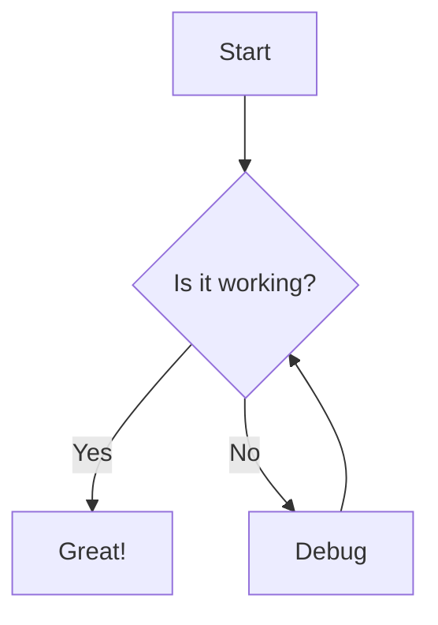

# Advanced Markdown Previewer

A powerful, feature-rich web application that allows you to write Markdown and see a live preview of the rendered HTML, with support for advanced features like math equations and diagrams.

## Features

- **Live Preview**: See changes as you type with real-time rendering
- **Complete Markdown Support**:
  - Headers (H1-H6)
  - Emphasis (bold, italic, strikethrough)
  - Lists (ordered and unordered)
  - Links
  - Images
  - Blockquotes
  - Code blocks with syntax highlighting
  - Tables
  - Task lists
  - Horizontal rules
  - HTML support
- **Advanced Authoring**:
  - Mathematical equations via KaTeX
  - Diagrams and flowcharts with Mermaid.js
  - Code syntax highlighting via Highlight.js
- **Rich Editing Tools**:
  - Organized formatting toolbar with grouped controls
  - Word and character counter
  - Interactive task lists (checkboxes work in preview!)
  - Word wrap toggle
  - Spell check toggle
- **Modern UI**:
  - Dark/light theme toggle
  - Fullscreen mode
  - Focus mode for distraction-free writing
  - Responsive design for all devices
  - Beautiful animations and transitions
  - Loading overlay for intensive operations
- **File Operations**:
  - Auto-save to local storage
  - Import files via drag & drop or file picker
  - Copy markdown to clipboard
  - Copy generated HTML to clipboard
  - Export to multiple formats:
    - Markdown (.md)
    - HTML (.html)
    - PDF (.pdf) with optimized rendering
- **Preview Controls**:
  - Toggle between different preview modes (split view, preview focused, preview only)
  - Table of Contents navigation with automatic highlighting
- **Productivity Features**:
  - Keyboard shortcuts for common actions
  - Shortcuts guide/cheatsheet
  - Performance optimizations for large documents
- **Security Features**:
  - HTML sanitization to prevent XSS attacks

## Usage

1. Open `index.html` in your web browser
2. Type or paste Markdown in the left panel
3. See the rendered HTML in the right panel
4. Use the toolbar buttons to quickly insert common Markdown elements
5. Import existing files by dragging them onto the page
6. Export your work as Markdown, HTML, or PDF
7. Use keyboard shortcuts (press the keyboard icon to see all shortcuts)
8. Try focus mode for distraction-free writing
9. Toggle spell check on/off as needed
10. Your content is automatically saved to your browser's local storage

No server or internet connection required! Everything runs locally in your browser.

## Math Equations

Use `$` for inline math and triple backticks with the "math" language for block equations:

```
Inline: $E = mc^2$

Block:
```math
\frac{d}{dx}\left( \int_{0}^{x} f(u)\,du\right)=f(x)
```
```

## Diagrams

Create diagrams using triple backticks with the "mermaid" language:

```

```

## Table of Contents

Create a table of contents for your document by adding:

```
## Table of Contents

[TOC]

The TOC will be automatically generated from your document's headings. You can also toggle the sidebar TOC using the list icon in the header or by pressing `Ctrl+T`.

## Performance Optimizations

This Markdown Previewer includes several performance enhancements:

- Debounced rendering to avoid lag during typing
- Parallel processing of rendering tasks 
- Optimized PDF export
- Efficient TOC generation
- Loading overlays for intensive operations

## Technologies Used

- HTML5
- CSS3 with CSS Variables for theming
- JavaScript (ES6+)
- [Marked.js](https://marked.js.org/) - Markdown parser and compiler
- [DOMPurify](https://github.com/cure53/DOMPurify) - HTML sanitizer to prevent XSS
- [highlight.js](https://highlightjs.org/) - Syntax highlighting for code blocks
- [KaTeX](https://katex.org/) - Math equation rendering
- [Mermaid.js](https://mermaid-js.github.io/) - Diagram and flowchart rendering
- [html2pdf.js](https://github.com/eKoopmans/html2pdf.js) - PDF export
- [Font Awesome](https://fontawesome.com/) - Icons for the UI

## License

MIT 
